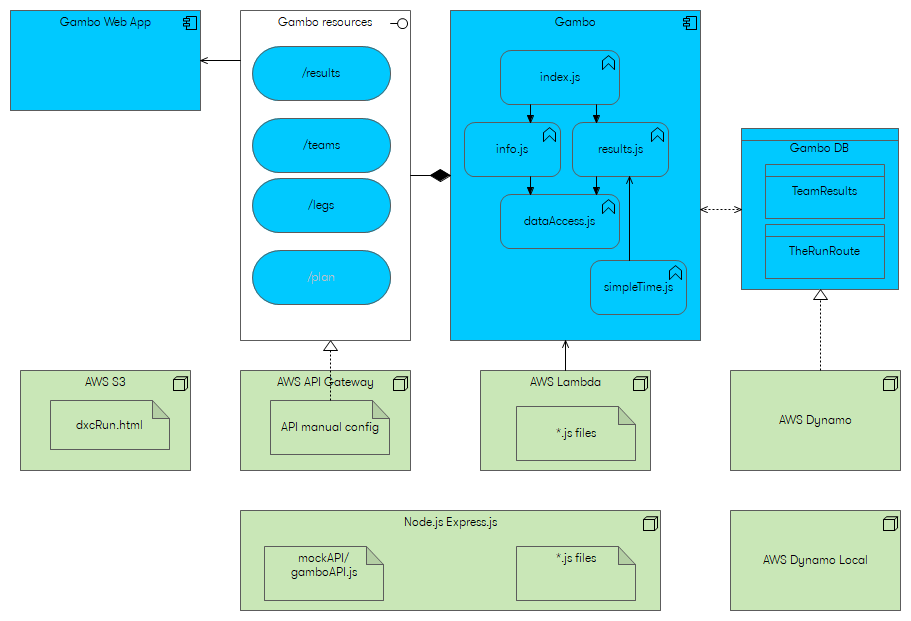

# Kryštálová guľa

Zobrazovanie priebežných výsledkov počas behu.

## 1. Pripraviť data v potrebnej štruktúre

Tieto údaje získam parsovaním popisov trás, od organizátorov, z excelov, ... to je špecifické pre každý beh. Dôležité je len aby som na konci mal takýto json. Spracovanie je v adresároch VltavaRun, TheRun.


**Tabuľka TeamResults**

| Atribút     | Význam |
| :---------- | :----- |
| team           | číslo tímu je kľúč, podľa toho sa vyhľadáva v tabuľke|
| name           | názov tímu |
| startTimes     | úseky, ktoré majú pevne definovaný štart majú tu definované kedy začínajú. Normálne je to iba prvý úsek (index 0), ale napr. pre The Run je tam aj úsek z Tepličky, ktorý má fixný štart, takže by tam bol aj 28: "17:10:00" |
| legs           | Zoznam úsekov. |
| leg.distance   | Dĺžka úseku v km. Musí to byť číslo, nie string, takže musí obsahovať desatinnú bodku, nie čiarku. |
| leg.difficulty | Náročnosť úseku. musí to byť číslo, nie string, takže musí obsahovať desatinnú bodku, nie čiarku. |
| leg.up/down    | Stúpanie a klesanie na úseku v m. Musí to byť celé číslo, nie string. |
| from/to, gpx   | Začiatočný a koncový bod úseku s gps súradnicami. Všetko sú stringy. |
| runnerName     | Musí byť zadané, zobrazujeme pri úseku |
| plannedTempo   | Musí byť zadané, podľa neho a distance sa vypočíta plannedDuration. |


```javascript
{
	"team": 29
	"name": "DXC Dream Team",
	"startTimes": {
		0 : "08:20:00"
	}
    "legs": [
        {
            "distance": 14.10,
            "difficulty": 3.5,
            "down": 380,
            "up": 160,
			
            "from": "Zadov – Churánov",
            "gpxfromLat": "49.0673939",
            "gpxfromLng": "13.6195222",
			
            "to": "Lipka",
            "gpxtoLat": "49.0195900",
            "gpxtoLng": "13.7325347",
			
            "runnerName": "Vojto Bálint",
            "plannedTempo": "04:45",
        }, ... dalsie useky
	]
}		
```

## 2. Nahrať tabuľku do databázy

1. Ak idem lokálne, tak potrebujem mať spustenú lokálnu databázu, to zabezpečí script `scripts\startCmder.bat`
1. V adresári `scripts\DBsetup\` v súbore `sripts.txt` je script pre vyvtorenie tabuľky TeamResults lokálne aj na AWS.
1. Script `storeTeamResultsIntoLocalDB.bat` vytvorí adresár `temp` do ktorého sa nahrajú súbory `fillTableTeam.js` a `gambo.core` a lokálny alebo aws `config`. Potom sa spustí `fillTableTeam.js`, ktorý načíta súbor s úsekmi a nahrá ho do databázy. Tu možno treba zmeniť, aký súbor sa nahrá.

## 3. Lokálne spustenie aplikácie

1. Musím mať spustenú lokálnu databázu, to zabezpečí script `scripts\startCmder.bat`
1. Na záložke lokalApp cmdera spustiť script `scripts\deployLocaly\deployLocaly.bat`. Ten vytvorí adresár `gambo` do ktorého sa nahrajú zdrojáky z `gambo` a súbor `mockAPI\gamboAPI.js` ktorý simuluje aws api (a pri deployi na aws nie je potrebný). Pribalí sa tam `config` s lokálnymi hodnotami. Potom sa spustí mock `gamboAPI.js`, ten obsahuje webserver, ktorý počúva na porte 3000 a simuluje aws.
1. Script zároveň nakopíruje súbor `gambo.web\dxcRun.html` do adresára `web`, pričom v ňom upraví, aby requesty išli na lokálny service `http://localhost:3000`
1. V browseri otvoriť [web\dxcRun.html](file:///C:/Projects_src/Personal/gambo2/scripts/deployLocaly/release/dxcRun.html)


## 4. Deployment na AWS

1. Na záložke lokalApp cmdera spustiť script `scripts\runAppLocaly\runAppLocaly.bat`. Ten vytvorí adresár `gambo` do ktorého sa nahrajú zdrojáky z `gambo` a súbor `mockAPI\gamboAPI.js` ktorý simuluje aws api (a pri deployi na aws nie je potrebný). Pribalí sa tam `config` s lokálnymi hodnotami. Potom sa spustí mock `gamboAPI.js`, ten obsahuje webserver, ktorý počúva na porte 3000 a simuluje aws.
1. Script zároveň nakopíruje súbor `gambo.web\dxcRun.html` do adresára `web`, pričom v ňom upraví, aby requesty išli na lokálny service  na AWS service `https://5ron7xepdc.execute-api.eu-central-1.amazonaws.com/prod`
1. V browseri otvoriť [AWS - dxcRun.html](http://gambo-vojtob.s3-website.eu-central-1.amazonaws.com/dxcRun.html)


## Ako budú prebiehať výpočty?
| Atribút     | Význam |
| :---------- | :----- |
| legs        | Zoznam úsekov, ďalej popisujem atribúty legu |
| realDuration | Ak je zadané, tak sa tento úsek už bežal. Na jeho základe sa vypočíta realTempo a diff. Diff je rozdiel medzi plannedDuration and realDuration. |
| startTime    | O koľkej sa tento úsek začal bežať. Ak ide o niektorý z úsekov, ktoré majú pevne dané štartové časy (zvyčajne iba prvý úsek), tak sa startTime nastaví podľa toho. Ak nie je pevne daný štart na tomto úseku, tak sa zoberie z endTime predchádzajúceho úseku. To znamená, že tento údaj sa nezadáva, vždy sa dopočíta. |
| endTime      | End time, o koľkej sa tento úsek dobehol. Ak je už zabehnutý, tak sa počíta pomocou realDuration, ak nie je zabehnutý, tak pomocou plannedDuration. |
| lastLegDone | Vypočítaný atribút, ktorý pomáha označovať práve bežiaci úsek |
| plan, real, route | Vypočítané údaje o celom behu. Predpočítavajú sa, aby sa vedelo rýchlejšie a jednoduchšie zobrazovať na webe plánovaný čas dobehu, predpokladané priemerné tempo a podobne. |


```javascript
{
	"team": 29
	"name": "DXC Dream Team",
	"startTimes": {
		0 : "08:20:00"
	}
    "legs": [
        {
            "distance": "14,10",
            "difficulty": "3",
            "down": "380",
            "up": "160",
			
            "from": "Zadov – Churánov",
            "gpxfromLat": "49.0673939",
            "gpxfromLng": "13.6195222",
			
            "to": "Lipka",
            "gpxtoLat": "49.0195900",
            "gpxtoLng": "13.7325347",
			
            "runnerName": "bezec 0",
            "plannedTempo": "05:20",

            "plannedDuration": "0:57:17",
            "startTime": "10:00:00",
            "endTime": "0:00:00",
            "realDuration": "",
            "realTempo": "",
            "diff": ""
        }, ...
	]
}		
```

# Architektúra

| Package, File | Popis |
| :------------ | :---- |
| Architecture  | Popis architektúry |
| config | obsahuje `configAWS.js` a `configLocal.js` ktoré definujú prístup na aws alebo testovanie na local. Tieto dva súbory sa kopírujú do distribúcie, podľa nich sa určí či sa ide lokálne alebo na aws. |
| gambo         | Hlavný adresár aplikácie |
| gambo/index.js         | Definuje API rozhranie tak ako to vyžaduje AWS API. Rozlišuje GET a POST a rôzne resources. Toto je iba prevolávanie metód, nieč viac, žiadna logika. Nahrá sa na AWS ako lambda. |
| gambo/gambo.core | Obsahuje celú logiku, súbory sú popísané nižšie. Nahrá sa na AWS ako lambda. |
| gambo.web | Webové stránky |
| scripts | obsahuje scripty pre vytvorenie db, deployment, testovanie |
| TheRun, VltavaRun | spracovanie trasy pre jednotlivé behy, aby som získal základný TeamResults json. |



## Súbory v gambo

* index - spracovanie parametrov volania resource a mapovanie na metódy v `results` alebo `info`
* results - práca s výsledkami, nastavovanie plánovaného tempa, skutočného trvania a získanie výsledkov
* info - ???
* data-access - prístup k dátam, tu sa volajú AWS metódy pre tabuľky
* simpleTime - prevod medzi číselným a textovým vyjadrením času, napr. "01:23:45" je 5025 sekúnd a naopak ... 

## Resources v gambo

???